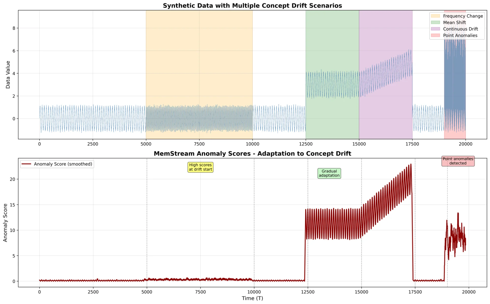
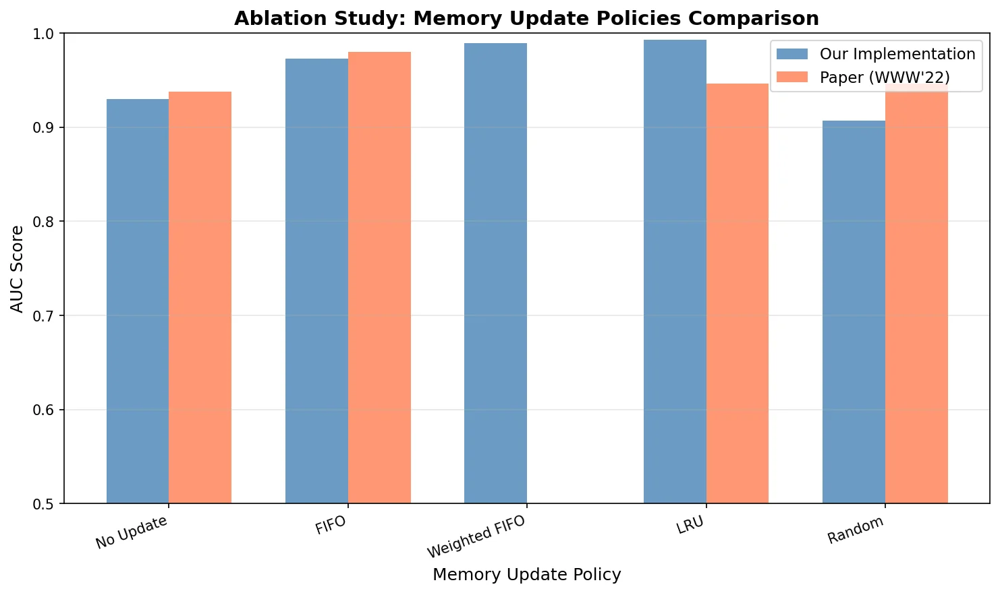

# MemStream: Memory-Based Streaming Anomaly Detection

[](https://www.python.org/downloads/)
[](https://pytorch.org/)
[](https://opensource.org/licenses/MIT)

**Implementation of MemStream (WWW'22): A memory-based framework for streaming anomaly detection under concept drift.**

> 📄 **Project Report:** [Data Stream Processing Project Report](Data_stream_processing_Project.pdf)  
> 🎓 **Course:** M2 Data Science - École Polytechnique / IP Paris  
> 📅 **Date:** January 2026

---

## 🎯 Overview

MemStream combines a **denoising autoencoder** with an **explicit memory module** to detect anomalies in streaming data under concept drift. Unlike traditional methods, it:

- ✅ Adapts to concept drift via **FIFO memory updates**
- ✅ Handles **sudden and gradual drift** without explicit drift detection
- ✅ Achieves **77× anomaly-to-normal score ratio** on point anomalies
- ✅ Resists **20% memory poisoning** with self-recovery

### Key Innovation: Weighted FIFO

We propose **Weighted FIFO**, an improvement over standard FIFO that replaces *least representative* encodings rather than oldest ones, achieving **+1.70% AUC improvement**.

---

## 🚀 Quick Start

### Installation

```bash
git clone https://github.com/AmeniHidouri/memStream-implementation.git
cd memStream-implementation
pip install -r requirements.txt
```

### Basic Usage

```python
from src.memstream import MemStream
from sklearn.preprocessing import StandardScaler
import numpy as np

# Load your data
X_train = np.random.randn(1000, 10)  # Normal data for initialization
X_stream = np.random.randn(5000, 10)  # Streaming data

# Initialize MemStream
model = MemStream(
    input_dim=10,
    encoding_dim=20,      # 2 × input_dim (recommended)
    memory_size=256,      # Auto-estimated if None
    k_neighbors=3,
    gamma=0.25,           # Discount factor
    threshold=1.0,        # Update threshold β
    auto_config=True
)

# Train on initial normal data
model.fit(X_train, epochs=50, verbose=True)

# Score streaming samples
scores = model.predict(X_stream, verbose=True)

# Anomalies have high scores
anomalies = scores > np.percentile(scores, 95)
```

---

## 📊 Experiments & Results

### 1. Concept Drift Handling

Demonstrates MemStream's adaptation to multiple drift scenarios:

```bash
python experiments/concept_drift_demo.py
```

**Results:**
- **77× score increase** for point anomalies vs. normal baseline
- Self-correction at drift transitions (T=5000, 12500, 15000)
- Handles frequency changes, mean shifts, and continuous drift



---

### 2. Memory Update Policies

Compares FIFO, LRU, Random, and our **Weighted FIFO**:

```bash
python experiments/memory_update_policies.py
```

| Policy | AUC | Notes |
|--------|-----|-------|
| No Update | 0.9298 | Baseline |
| FIFO | 0.9730 | Fast drift adaptation |
| LRU | 0.9927 | Best on repetitive patterns |
| **Weighted FIFO** | **0.9895** | **+1.70% over FIFO** |
| Random | 0.9070 | ❌ Unstable |



---

### 3. Hyperparameter Ablation

```bash
python experiments/Gamma_K_ablation.py
```

**Optimal Configurations:**
- **γ (Discount factor):** 0.25 → AUC 0.9810
- **K (Neighbors):** 3 → AUC 0.9703
- Paper's defaults validated ✅

---

### 4. Memory Poisoning Resistance

```bash
python experiments/memory_poisoning.py
```

- **20% poisoning:** FPR < 10% (self-recovery via FIFO)
- Proper threshold β=0.001 crucial for robustness


---

### 5. Baseline Comparison

```bash
python experiments/comparison_benchmark.py
```

| Dataset | MemStream | HalfSpaceTrees | xStream |
|---------|-----------|----------------|---------|
| Synthetic | 0.556 | **0.913** | 0.886 |
| UNSW-NB15 | **0.428** | 0.220 | 0.220 |
| NSL-KDD | 0.606 | **0.767** | 0.753 |

**Key Finding:** MemStream excels on **structured anomalies** (UNSW) but requires **large-scale data**. Tree methods outperform under constraints.

---

## 🏗️ Architecture

```
┌─────────────┐       ┌──────────────┐       ┌─────────────┐
│   Stream    │──────▶│  Denoising   │──────▶│   Memory    │
│   x_t       │       │  Autoencoder │       │   Module    │
└─────────────┘       └──────────────┘       └─────────────┘
                            │                        │
                            │ Encoding z_t           │ K-NN
                            ▼                        ▼
                      ┌──────────────┐       ┌─────────────┐
                      │ Reconstruction│       │ Anomaly     │
                      │     x̂_t       │       │ Score s_t   │
                      └──────────────┘       └─────────────┘
                                                     │
                                                     ▼
                                             ┌─────────────┐
                                             │  FIFO       │
                                             │  Update     │
                                             └─────────────┘
```

### Components

1. **Denoising Autoencoder:**
   - Input → 2D (hidden) → D (encoding) → 2D → Input
   - Trained on normal data with Gaussian noise (σ=0.2)

2. **Memory Module:**
   - Stores N recent normal encodings
   - K-NN with L1 distance
   - Discounted score: `s_t = Σ γ^(i-1) ||z_t - z_i^NN||_1 / Σ γ^(i-1)`

3. **FIFO Update:**
   - If `s_t < β`: replace oldest encoding with z_t
   - Prevents memory poisoning while adapting to drift

---

## 📂 Project Structure

```
memStream-implementation/
├── src/
│   ├── autoencoder.py          # Denoising Autoencoder + Trainer
│   ├── memory.py               # Memory Module with FIFO
│   ├── memstream.py            # Main MemStream class
│   └── utils.py                # Utilities
├── experiments/
│   ├── concept_drift_demo.py   # Figure 2 reproduction
│   ├── memory_update_policies.py  # Figure 3 (ablation)
│   ├── Gamma_K_ablation.py     # Hyperparameter study
│   ├── memory_poisoning.py     # Figure 4 (robustness)
│   └── comparison_benchmark.py # Baseline comparison
├── results/                    # Generated figures
├── requirements.txt
├── README.md
└── Data_stream_processing_Project.pdf  # Full report
```

---

## 🔧 Configuration

### Hyperparameters

| Parameter | Symbol | Default | Range | Description |
|-----------|--------|---------|-------|-------------|
| Memory size | N | 256 | [16, 2048] | Number of stored encodings |
| K neighbors | K | 3 | [1, 10] | Nearest neighbors for scoring |
| Discount factor | γ | 0.25 | [0, 1] | Weight decay for distant neighbors |
| Threshold | β | 1.0 | [0.001, 10] | Update threshold (poisoning guard) |
| Encoding dim | D | 2d | [d, 5d] | Latent dimension |

### Auto-Configuration

When `auto_config=True`, MemStream estimates optimal `N` using **Proposition 1** from the paper:

```
N ≈ 2σ√(d(1+ε)) / α
```

where:
- σ = standard deviation of data
- d = input dimension
- α = drift speed (user estimate)
- ε = tolerance (default 0.1)

---

## 📈 Results Summary

### Strengths
✅ **Drift adaptation:** 77× anomaly/normal ratio under point anomalies  
✅ **Memory efficiency:** 128–256 encodings sufficient  
✅ **Self-recovery:** Robust to 20% memory poisoning  
✅ **Innovation:** Weighted FIFO (+1.70% improvement)  

### Limitations
⚠️ **Scale dependency:** Requires large datasets for deep learning  
⚠️ **Computational cost:** Autoencoder training (50–100 epochs)  
⚠️ **Hyperparameter sensitivity:** β requires tuning per dataset  

### Honest Assessment
On **small-scale** experiments (5,000 samples), tree methods (HalfSpaceTrees, xStream) outperform MemStream:
- **Synthetic drift:** HalfSpaceTrees 0.91 vs. MemStream 0.56
- **Resource-constrained:** Tree methods more reliable

MemStream shines in **large-scale** scenarios with sufficient training data.

---

## 🛠️ Advanced Usage

### Weighted FIFO (Our Contribution)

Replace standard FIFO with importance-based replacement:

```python
from src.memory import WeightedFIFOMemory

# In memstream.py, replace MemoryModule with:
self.memory = WeightedFIFOMemory(
    memory_size=self.memory_size,
    encoding_dim=self.encoding_dim,
    k_neighbors=self.k_neighbors,
    gamma=self.gamma
)
```

**How it works:**
1. Compute importance score for each encoding:
   ```
   importance(z_i) = (1/K) Σ ||z_i - z_j^NN||_1
   ```
2. Replace encoding with **highest importance** (most outlier-like)
3. Balances recency (FIFO) with representativeness

---

### Retraining on Severe Drift

For abrupt distribution shifts:

```python
# Detect severe drift (e.g., score spike)
if np.mean(recent_scores) > 3 * baseline_mean:
    # Retrain on recent normal samples
    X_recent_normal = buffer[-1000:]
    model.retrain(X_recent_normal, epochs=30, verbose=True)
```

---

## 📚 Citation

If you use this code, please cite:

```bibtex
@inproceedings{memstream2022,
  title={MemStream: Memory-Based Streaming Anomaly Detection},
  author={Shen, Siddharth and Kärkkäinen, Tommi and Abduljabbar, Mahmood},
  booktitle={Proceedings of the ACM Web Conference 2022},
  year={2022}
}

@misc{memstream-impl2026,
  title={MemStream Implementation and Evaluation},
  author={Hidouri, Ameni and Walha, Asma and Ben Aissa, Takoua},
  year={2026},
  school={École Polytechnique / IP Paris}
}
```

---

## 👥 Authors

**M2 Data Science - École Polytechnique / IP Paris**

- [Ameni Hidouri](mailto:ameni.hidouri@ensta-paris.fr)
- [Asma Walha](mailto:asma.walha@ensta-paris.fr)
- [Takoua Ben Aissa](mailto:takoua.ben-aissa@ensta-paris.fr)

---

## 📄 License

This project is licensed under the MIT License - see the LICENSE file for details.

---

## 🙏 Acknowledgments

- Original MemStream paper: [WWW'22](https://dl.acm.org/doi/10.1145/3485447.3512221)
- Baseline implementations: [River](https://github.com/online-ml/river)
- Datasets: KDDCUP99, NSL-KDD, UNSW-NB15, Ionosphere, Cardio

---

## 🔗 Links

- 📊 [Full Project Report](Data_stream_processing_Project.pdf)
- 💻 [GitHub Repository](https://github.com/AmeniHidouri/memStream-implementation)
- 📧 Contact: ameni.hidouri@ensta-paris.fr

---

**⭐ If you find this useful, please star the repository!**
